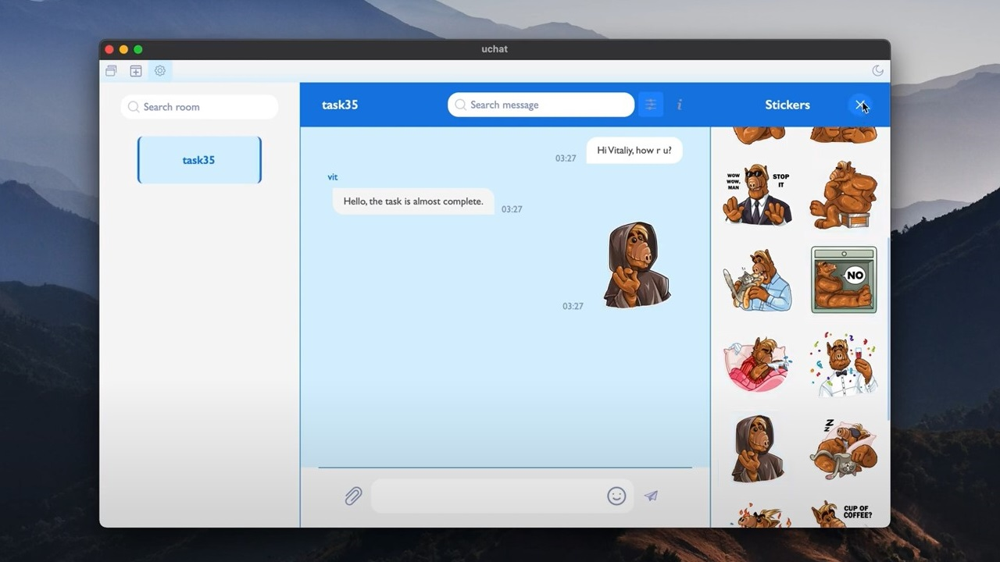
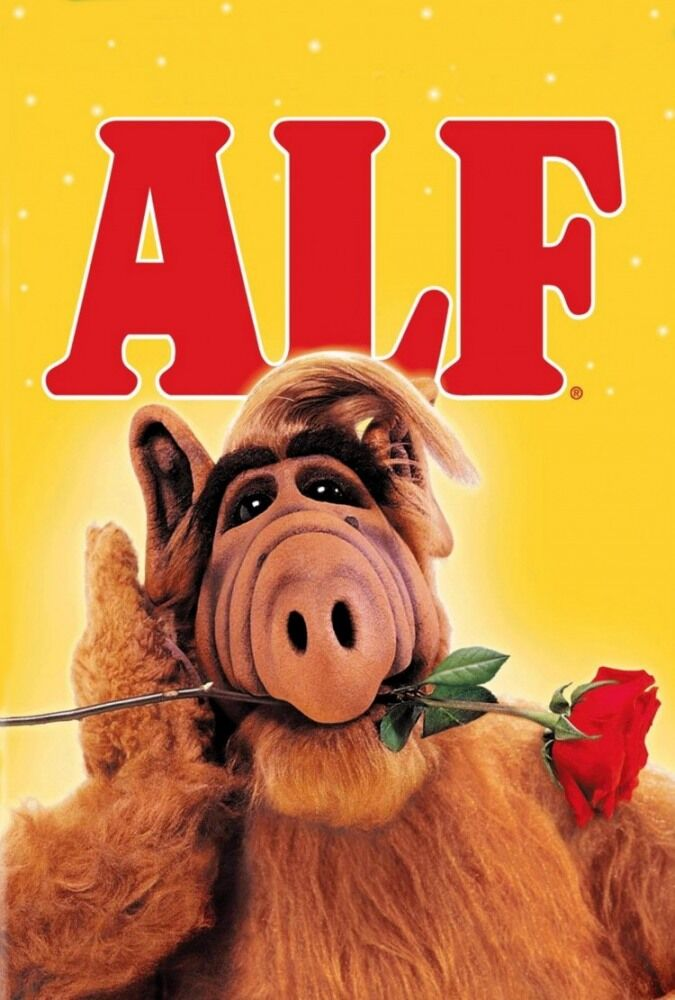

    
    <h1 align="center">Ucode-Chat</h1>
     

  

**Messaging app written on C language, used tools: GLib, cJSON, sqlite3, GTK3 and Glade** 

	

## About the program

- Support OS: Ubuntu, MacOS
- Default compilation mode: `make`
- Compilation in debug mode: `cd client; make debug; cd ..`
- Files for use: uchat, uchat_server

## How to use:
1. `git clone https://github.com/vit-um/uchat.git`
2. `cd uchat`
3. `make`
4. Start server: `./uchat_server <port>`
5. Start client: `./uchat <ip address> <port>` or `./uchat <hostname>:<port>`
6. Sign up

**Do you know who Alf is? How old is he and what does his name mean?😊**

<table>
	<tr>
		<td>

		</td>
		<td>
<b>- You don’t like cats?   You just don't know how to cook them!</b>			
 		</td>
	</tr>
</table>

